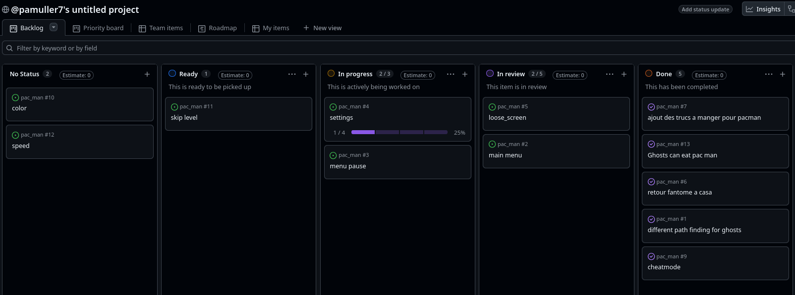

*this project has been created as part of the 42 curriculum by pamuller, mobenais.*

# Pac Man

## Description

Recreate the famous arcade game Pac-Man with a modern Python codebase, 
a clean project structure, and a deployable build.
to be enought accurate to the subject we use all py game function that appear in wrapper 
python of mlx 42

Contributions:
| contributor| Implemented| Fix |
|:-----:|:-------:|:------:|
| mobenais| engine.py, config.py, display.py, menu| refacto| 
| pamuller| entites/, menu (algos)| config.py |  

## Instructions

This project includes a makefile. For a simple test, execute:
```sh
make run
```

this will first install the project with:
```sh
uv sync
uv pip install mazegenerator-2.1.0-py3-none-any.whl
```

then run the main program with:
```sh
uv run pac-man.py [config_file.json]
```
the config file must be a valid json file, as described in the `Configuration` part

to create a pac man binary, run
```sh
make build
```
it will create a dist directory. to run the binary:
```sh
./dist/pac-man/pac-man [config_file.json]
```

Otherwise you can install the project on: https://xx-darkpacman-xx.itch.io/pacman (private).
You will have to write your own config.json file, empty for simple run, or following the configuration part.


### Configuration
eg of a configuration file:
```json
{
    "highscore_filename": "data/scores.json",
    "lives":3, -> can not be < 1
    "points_per_pacgum": 10, -> can not be < 0
    "points_per_super_pacgum": 50, -> can not be < 0
    "points_per_ghost": 200, -> can not be < 0
    "level_max_time": 90, -> can not be < 1
	"max_nb_level": 10, -> can not be < 1
    "levels": [
        { 
		  "width": 15, -> can only be in [15, 60]
		  "height": 15, -> can only be in [15, 60]
		  "seed": 1000000, -> can not be < 1000000, drawn at random if missing or invalid
          "pacgum": x, -> x int > 0, if not defined or invalid, we calculate it to fill 100% of the maze
		}
    ]
}
```
Here, all of those keys are set to their default values.
You can modify it if you like, or remove some.
If weird things happends, like "lives": -1, the system fallsback and sets the lives back to their default values.

`"pacgum"` is a top-level key only: it sets the number of pacgums of every
level of the run. Put inside a level it is ignored, with a warning.

A run plays the levels of `"levels"` in order and stops there, so the number
of levels you write is the length of a game. `"max_nb_level"` only caps it:
with 5 levels and `"max_nb_level": 2`, only the first 2 are played.

### Highscore

The highsocre system stores a Player class, at the end of a game , it takes the total result, at the end of a game (win or loose), asks for the name and stores it in a json file (data/scores.json).
If any problem in the json file, asks to rewrite the corrupted one in an other file for archive and correct it with the default format.

If there is 10 scores, a new one will be written only if it's higher than the existing ones.


### Maze Generation
The maze package is used in pac-man.py, in the `new_maze()` function.
We create a new maze object, with the specified size and seed, and returns the maze infos, a list of ints encoding the maze, where each bit of a cell tells if there is a wall or not.

### Implementation

### <u>Entity System</u>

The `Entity` class is the base class for all movable objects in the game. It provides the common functionality required by both Pac-Man and ghosts, such as:

- position management;
- movement and collision checking;
- health and life management;
- rendering state management;
- pathfinding utilities;
- collision handling.

Each entity owns a `Pos` object that stores its coordinates inside the maze. Movement is performed by updating this object, while the `can_move()` method checks whether a movement is possible according to the maze walls.

The `Entity` class also maintains a global registry of all existing entities. This allows the game engine to easily check collisions between Pac-Man and ghosts.

### <u>Pac-Man Implementation</u>

The `PacMan` class inherits from `Entity` and implements the player-controlled character.

It manages:

- score tracking;
- animations depending on the current direction;
- different states (invincible, eating, normal)

Pac-Man has multiple states:

- normal mode, where ghosts cannot be eaten;
- super mode, where pac man is invinsible (eg: after getting eaten);
- eating mode, where ghosts can be eaten
- god mode, used for testing purposes.

### <u>Ghost Implementation</u>

The `Ghost` class inherits from `Entity` and contains the common behavior shared by all enemies.

Ghosts manage:

- their target tile;
- their current behavior mode;
- their distance from Pac-Man;
- their speed;
- their scared and respawn states.

Ghost behavior is divided into several states:

- **Chase mode and chill mode**: the ghost follows a specific targeting strategy.
- **Scared mode**: activated when Pac-Man eats a power pellet, making ghosts vulnerable and running away from pac man.
- **Dead mode**: after being eaten, the ghost returns to its spawn position before respawning.

### <u>Ghost AI</u>

The four ghost types use different strategies:

- **Red Ghost**: directly targets Pac-Man's current position.
- **Blue Ghost**: predicts Pac-Man's movement by using both Pac-Man's position and the red ghost's position.
- **Orange Ghost**: changes behavior depending on the distance to Pac-Man, either moving toward the center of the maze or chasing the player.
- **Purple Ghost**: predicts Pac-Man's future position by targeting a tile several cells ahead of Pac-Man's current direction.

### <u>Pathfinding</u>

Ghost movement uses a Breadth-First Search (BFS) algorithm implemented in the `Entity` class.

The algorithm calculates the shortest path between the ghost's current position and its target tile. The generated path is stored as a sequence of directions (`N`, `E`, `S`, `W`) which the ghost follows during gameplay.

### <u>Collision System</u>

Collisions are handled centrally by the `Entity` class.

At each update, the game checks whether two entities occupy the same maze cell. Depending on their current states, the collision can result in:

- Pac-Man losing a life;
- Pac-Man eating a vulnerable ghost;
- score updates;
- ghost respawning.

### <u>PacGums</u>

The `Pacgum` class represents the collectible items placed throughout the maze. Each pacgum stores its position, rendering information, score value, and whether it is a normal pacgum or a super pacgum.

All existing pacgums are stored in a global registry using their coordinates as keys. This allows the game to quickly check whether Pac-Man is currently standing on a collectible item.

The system provides:

- pacgum creation and registration;
- collision detection with Pac-Man;
- score management;
- super pacgum activation;
- reset of all pacgums when starting a new level.

When Pac-Man reaches a pacgum, the `check_eaten()` method removes it from the registry and calls `is_eaten()`.

Depending on the type of pacgum:

- **Normal pacgum**: increases Pac-Man's score by the configured amount.
- **Super pacgum**: increases the score and activates Pac-Man's hunting mode, making ghosts vulnerable for a limited duration.


### General Software Architecture
high-level overview of the soft-ware architecture (modules, classes, and their relationships).
```
pac-man.py 
|
-> config.py
|
-> game_loop() <------------------------------------
|                                                  |
-> Level                                           |
|                                                  |
-> Graphical renderer                              |
|                                                  |
-> Engine -> Pac man |                             |
|         |          | inherit from entiy          |
|         -> Ghosts  |                             |
|         |                                        |
|         -> render_display                        |
|                                                  |
-> Scoreboard --------------------------------------
```

Game is the central component of the application. It manages the game loop and coordinates the Level, pac-man, Ghost and UI components.

Each Level contains a Maze, pacgums and ghosts. The pac-man interacts with the maze and collects pacgums, while Ghost objects move autonomously and interact with the player.

The HighscoreManager is responsible for loading and saving persistent scores independently from the game logic.


### Project Management
Organisation was made using kanban, from github projects.
It helped us to brainstorm and store new features, and pick one when someone is available.
we mainly used discord for update and discussion.



link for the kanban section:
https://github.com/users/pamuller7/projects/2

## Resources

pac man ghosts ia : https://pacman.fandom.com/wiki/Maze_Ghost_AI_Behaviors
pac man google : pac man on google
sprites : https://www.spriters-resource.com/arcade/pacman/
mlx : https://github.com/42school/mlx_CLXV (to look at available funcitions, for pygame)
pygame : https://www.pygame.org/docs/

AI usage:
-> pyinstall understanding (creation of the binary pacman)
-> fixing mooves for ghosts (like avoid them to stay on the same spot for too long)
-> README (having an idea of what is expected in each sections)
-> understanding pygame mechanics to be near as possible to mlx 
-> refacto for well communcation with the mate
